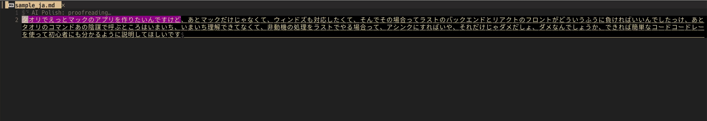

[](https://github.com/umiyosh/ai-polish.nvim/actions/workflows/ci.yml)
[](./LICENSE)
[](https://neovim.io)

# ai-polish.nvim

[English](README.md) | 日本語

**Neovim で書いた文章を Gemini にレビューしてもらい、直すかどうかは 1 件ずつ自分で決められます。**

Visual モードで選んだ範囲か、バッファ全体に対して `:AiPolish` を実行します。指摘された箇所には下線が引かれ、フローティングウィンドウに該当箇所、最大 3 つの修正案、その理由が 1 件ずつ表示されます。修正案を採用しない限り、本文はそのままです。



## 特徴

ai-polish.nvim は Gemini をレビュアーとして使います。文章をまるごと書き直させて新旧を見比べる、という手間はかかりません。

- 指摘は小さく分かれて届きます。Gemini には、直す範囲を最小限にすること、1 件に含める修正は 1 つだけにすること、段落ごと書き直さないことを指示しています。1 件ずつ、その場で判断できます。
- 反映するかどうかは自分で選びます。`a` で採用、`x` で却下、`]` / `[` で前後の候補へ。採用した修正は、1 件ごとに undo 1 回で元に戻せます。
- 校正の途中でも本文を編集できます。候補はバッファ上の位置に固定してあり、適用の直前に現在のテキストと照合します（[設計メモ](#設計メモ)）。
- 画面はバッファのまま。チャット画面やサイドウィンドウは開かず、ポップアップは指摘箇所のすぐそばに出ます。
- 知らないうちに大量のテキストが送られることはありません。サイズとコストを手元で概算し、大きなリクエストは確認を取ってから送ります（[長い文書の扱い](#長い文書の扱い)）。

## 要件

- Neovim 0.11 以上
- `curl`
- Gemini API キー（発行手順は [Gemini API キーの発行](docs/api-key.ja.md)）

他のプラグインは必要ありません。

## インストール

[lazy.nvim](https://github.com/folke/lazy.nvim):

```lua
{
  "umiyosh/ai-polish.nvim",
  cmd = "AiPolish",
  keys = {
    { "<leader>ap", "<Plug>(ai-polish-selection)", mode = "x", desc = "Proofread selection" },
    { "<leader>ap", "<Plug>(ai-polish-buffer)", mode = "n", desc = "Proofread buffer" },
    { "<leader>ar", "<Plug>(ai-polish-review)", mode = "n", desc = "Review suggestions" },
  },
  opts = {},
}
```

`setup()` は省略でき、呼ばなければデフォルト設定で動きます。

## API キーの設定

キーは次の順に探します。

1. `setup({ api_key = ... })` に渡した文字列、または文字列を返す関数
2. 環境変数 `GEMINI_API_KEY`
3. 環境変数 `GOOGLE_API_KEY`

設定ファイルにキーを直接書くのは避けてください。シェルの環境変数に入れるか、パスワードマネージャから関数で読み出すのがおすすめです。関数を渡した場合、呼ばれるのは初めて使うときで、結果は次に `setup()` を呼ぶまでキャッシュされます。失敗したときや空文字が返ったときは、次回もう一度呼ばれます。なお、空文字で export された環境変数は未設定として扱います。

```sh
# ~/.zshrc など
export GEMINI_API_KEY="..."
```

```lua
-- macOS キーチェーンから読む例
opts = {
  api_key = function()
    return vim.trim(vim.fn.system({ "security", "find-generic-password", "-s", "gemini-api-key", "-w" }))
  end,
}
```

```lua
-- 1Password CLI から読む例
api_key = function()
  return vim.trim(vim.fn.system({ "op", "read", "op://Private/Gemini/credential" }))
end
```

キーは `x-goog-api-key` ヘッダに載せて送ります。curl へはパーミッション 0600 の一時ファイル経由で渡すため、`ps` で見えるコマンドラインにキーは出ません。

curl が入っているか、キーが設定されているかは `:checkhealth ai-polish` で確認できます。

> [!IMPORTANT]
> 校正する文章は Google の Gemini API に送信されます。無料枠のキーでは、送った内容が Google のプロダクト改善に使われます（[利用規約](https://ai.google.dev/gemini-api/terms)）。機密文書を扱うなら有料枠のキーを使ってください。

## 使い方

| コマンド | 動作 |
| --- | --- |
| `:AiPolish` | バッファ全体を校正 |
| `:'<,'>AiPolish` | Visual モードの選択範囲を校正（文字単位の `v` 選択も範囲どおりに扱います） |
| `:AiPolish review` | 残っている候補のポップアップを開き直す（カーソル以降にある最初の候補から） |
| `:AiPolish cancel` | 実行中のリクエストを中止 |
| `:AiPolish clear` | 候補とハイライトをすべて消去 |

対象を明示したいときは `:AiPolish buffer` / `:AiPolish selection` と書くこともできます。

### ポップアップのキー

ポップアップが開くとフォーカスはそちらへ移ります。以下のキーが効くのはポップアップの中だけです。

| キー | 動作 |
| --- | --- |
| `a` / `<CR>` | カーソル行の修正案を採用（開いた時点でカーソルは第 1 案の行にあります） |
| `1` `2` `3` | その番号の修正案を採用 |
| `x` | 却下 |
| `]` / `[` | 次 / 前の候補 |
| `A` | 残りの候補をすべて第 1 案で採用（undo 1 回で戻せます） |
| `X` | 残りの候補をすべて却下 |
| `q` / `<Esc>` | 閉じる。候補は残るので `:AiPolish review` で再開できます |

ポップアップを閉じてバッファを編集しても問題ありません。編集で内容が変わった箇所の候補は、誤って適用されないよう自動的に外れます。

### 状態の表示

| 状態 | 表示 |
| --- | --- |
| 処理中 | 対象範囲の先頭行の末尾にスピナー（`⠋ AI Polish: proofreading 2/5…`） |
| 完了 | 件数を通知してポップアップを開きます。挿入モード中などで開けないときは `:AiPolish review` を案内します |
| 指摘なし | `no issues found` を通知 |
| エラー | HTTP ステータス、API のエラー文、安全性ブロックの理由を `vim.notify` の ERROR で表示 |
| 一部失敗 | 分割送信の一部が失敗すると WARN を出し、成功した分の候補だけを表示します |
| キャンセル | `:AiPolish cancel`、または確認ダイアログで Cancel |

ステータスラインに出したいときは `require("ai-polish").status()` を使ってください。返り値はアイドル時が空文字、処理中が `AI Polish 2/5`、候補が残っているときが `AI Polish: 3` です。

```lua
-- lualine の例
sections = { lualine_x = { function() return require("ai-polish").status() end } }
```

### 表示言語

ポップアップに出る分類・重要度の名前と、Gemini が書く指摘理由の言語は `locale`（`en` / `ja` / `zh`。`zh` は簡体字中国語）で決まります。
`locale` を指定しなければ `v:lang` / `$LANG` から判定し、判定できないときは英語になります。
修正案そのものは常に本文と同じ言語です。キー操作の案内だけは英語で表示されます。

## 長い文書の扱い

- 送信前に、サイズとコストをローカルで概算します。見積もりのために countTokens などの API は呼ばないので、承認する前に本文が外へ出ることはありません。
- 次のどれかを超えると `confirm()` ダイアログが出て、承認したときだけ送信します。
  - 文字数 `guard.confirm_chars`（既定 12,000）
  - 推定コスト `guard.confirm_cost_usd`（既定 $0.05）
  - リクエスト数 `guard.confirm_requests`（既定 4）
- `guard.max_chars`（既定 400,000 文字）を超えると送信せず、範囲を絞るよう案内します。
- `chunk.max_chars`（既定 6,000 文字）より長い文章は分割して送ります。区切り位置は段落 → 行 → 文末（`。` `．` など）→ 読点 → 空白の順に探し、リクエストは `chunk.concurrency`（既定 2）件ずつ並列に送ります。1 リクエストの出力が大きくなりすぎると JSON が途中で切れ（MAX_TOKENS）、指摘の精度も落ちるためです。

トークン数は ASCII なら 4 文字で約 1 トークン、日本語などそれ以外は 1 文字で約 1 トークンとして数えます。出力側は、入力の 6 割に固定のオーバーヘッドを足して見積もります。どちらも多めに出る目安で、実際の請求額とは一致しません。単価は `pricing` で上書きできます。

## 設定

既定値は次のとおりです。

```lua
require("ai-polish").setup({
  api_key = nil,                 -- string | fun(): string。nil なら $GEMINI_API_KEY / $GOOGLE_API_KEY
  model = "gemini-3.8-flash",
  endpoint = "https://generativelanguage.googleapis.com/v1beta",
  thinking_level = "low",        -- "low" | "medium" | "high" | nil（モデル既定）
  temperature = nil,
  timeout_ms = 120000,
  locale = nil,                  -- "en" | "ja" | "zh"。nil なら v:lang から判定し、判定できなければ "en"
  instructions = nil,            -- 追加指示（表記ルール、用語集など）

  chunk = { max_chars = 6000, concurrency = 2 },
  guard = {
    confirm_chars = 12000,
    confirm_cost_usd = 0.05,
    confirm_requests = 4,
    max_chars = 400000,
  },

  -- 見積もり用の単価（USD / 1M tokens）
  pricing = {
    ["gemini-3.8-flash"] = { input_per_mtok = 1.50, output_per_mtok = 7.50 },
    -- ...
  },
  default_pricing = { input_per_mtok = 1.50, output_per_mtok = 9.00 },

  ui = { border = "rounded", max_width = 80, winblend = 0 }, -- winblend: ポップアップの透過度（0-100）

  -- ポップアップ内のキー。false で無効化
  keymaps = {
    accept = "a", reject = "x", next = "]", prev = "[",
    accept_all = "A", reject_all = "X", close = "q",
  },
})
```

設定例です。

```lua
require("ai-polish").setup({
  model = "gemini-3.5-flash-lite", -- 安価なモデルに切り替える
  locale = "ja",
  instructions = [[
- 「行う」「おこなう」は「行う」に統一する
- 英単語と日本語の間に半角スペースを入れない
]],
  guard = { confirm_chars = 30000, confirm_cost_usd = 0.2 },
  keymaps = { next = "n", prev = "p" },
})
```

`pricing` の既定値には gemini-3.8-flash の標準単価（2027 年 1 月以降の価格）を入れています。2026 年末までの導入価格（$0.75 / $3.75）より高いので、見積もりは多めに出ます。

### ハイライト

どのグループも `default = true` でリンクしているので、カラースキーム側で上書きできます。

| グループ | 既定のリンク先 |
| --- | --- |
| `AiPolishCritical` / `AiPolishWarning` / `AiPolishSuggestion` / `AiPolishInfo` | `DiagnosticUnderline{Error,Warn,Info,Hint}` |
| `AiPolishCurrent` | `Visual` |
| `AiPolishDelete` / `AiPolishAdd` | `DiffDelete` / `DiffAdd` |
| `AiPolishTitle` / `AiPolishHint` | `Title` / `Comment` |
| `AiPolishProgress` | `DiagnosticVirtualTextInfo` |

## 設計メモ

- **位置の特定**: モデルに offset は返させません。返させるのは、原文から完全一致で抜き出した `before` と、前後の文脈 `context_before` / `context_after` です。プラグインは `before` の出現箇所をすべて探し、文脈がいちばん長く一致する箇所を選びます。見つからなかった候補や、他の候補と重なる候補は捨てます。
- **位置の追跡**: 候補は extmark としてバッファに固定します。別の候補を採用したり手で編集したりして位置がずれても、extmark がついていきます。適用する直前には固定範囲の現在のテキストを `before` と照合し、食い違っていれば適用しません。
- **応答形式**: Gemini の構造化出力（`responseMimeType: application/json` + `responseJsonSchema`）を使います。`promptFeedback.blockReason` や `finishReason`（SAFETY / MAX_TOKENS など）が返ってきた場合はエラー扱いです。
- **リトライ**: 429、5xx、ネットワークエラーのときは 1 秒後、2 秒後と最大 2 回まで再試行します。タイムアウトした場合は再試行しません。

## 開発

```sh
make test       # plenary.nvim の busted でテスト（初回は .tests/ に plenary を clone）
make lint       # luacheck
make fmt        # stylua で整形
make fmt-check  # 整形差分チェック
make check      # lint + fmt-check + test
```

手元の plenary を使うなら `PLENARY_DIR=/path/to/plenary.nvim make test` を実行してください。

CI（GitHub Actions）では、push と pull request のたびに次のジョブが走ります。

- test: Neovim v0.11.0 と stable のマトリクス
- lint: luacheck
- format: stylua `--check`

## License

MIT
