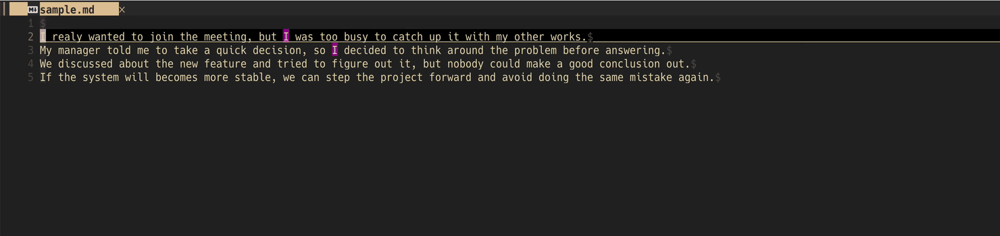

[](https://github.com/umiyosh/ai-polish.nvim/actions/workflows/ci.yml)
[](./LICENSE)
[](https://neovim.io)

# ai-polish.nvim

English | [日本語](README.ja.md)

**Write in Neovim. Let Gemini review. You decide what changes.**

Run `:AiPolish` on a visual selection or the whole buffer. Gemini's findings show up as underlines in the text, and a floating window walks you through them one at a time: the original span, up to three replacements, and the reason. Your text changes only when you accept a suggestion.



## Why ai-polish.nvim?

Many AI writing tools rewrite the selection and leave you to compare the new text with the old. ai-polish.nvim uses the model as a reviewer instead.

- **Small, separate fixes.** Gemini is asked for the minimal span to change, one fix per suggestion, never a rewritten paragraph. Each fix can be judged in a moment.
- **You apply every change.** `a` accepts, `x` rejects, `]` / `[` move between suggestions. Each accept is one undo step.
- **Safe to keep editing.** Suggestions are anchored in the buffer and re-checked against the current text before they are applied ([Design notes](#design-notes)).
- **Stays in the buffer.** No chat panel or side window. The popup opens at the text in question.
- **No surprise requests.** Size and cost are estimated locally, and large requests need your confirmation ([Large documents](#large-documents)).

## Requirements

- Neovim 0.11+
- `curl`
- A Gemini API key (see [Creating a Gemini API key](docs/api-key.md))

No other plugin dependencies.

## Installation

[lazy.nvim](https://github.com/folke/lazy.nvim):

```lua
{
  "umiyosh/ai-polish.nvim",
  cmd = "AiPolish",
  keys = {
    { "<leader>ap", "<Plug>(ai-polish-selection)", mode = "x", desc = "Proofread selection" },
    { "<leader>ap", "<Plug>(ai-polish-buffer)", mode = "n", desc = "Proofread buffer" },
    { "<leader>ar", "<Plug>(ai-polish-review)", mode = "n", desc = "Review suggestions" },
  },
  opts = {},
}
```

Calling `setup()` is optional; the plugin works with the defaults.

### Versions and updates

Releases use Git tags in the form `vMAJOR.MINOR.PATCH`. Published versions and release notes are listed on [GitHub Releases](https://github.com/umiyosh/ai-polish.nvim/releases).
The first planned release is **v0.1.0**. Until its tag is published, use the installation example above, which follows the default branch unless you configured a global version constraint in lazy.nvim.

After v0.1.0 is published, add **one** of these fields to the lazy.nvim specification above:

| Setting | Update behavior |
| --- | --- |
| `version = "^0.1.0"` | Recommended: receive 0.1.x releases, without moving to 0.2.0 |
| `tag = "v0.1.0"` | Stay on exactly v0.1.0 |
| `version = "*"` | Receive the latest release, including new minor/major versions; excludes prerelease tags |
| `branch = "master", version = false` | Follow development commits instead of releases |

Run `:Lazy update ai-polish.nvim` to update within the selected constraint. Commit your `lazy-lock.json` to reproduce installed revisions; `:Lazy restore` restores them. See lazy.nvim's [versioning](https://lazy.folke.io/spec/versioning) and [lockfile](https://lazy.folke.io/usage/lockfile) documentation.

With [vim-plug](https://github.com/junegunn/vim-plug), use an exact tag in your existing `plug#begin()` / `plug#end()` block after the release is published:

```vim
Plug 'umiyosh/ai-polish.nvim', { 'tag': 'v0.1.0' }
```

This plugin requires **Neovim 0.11+**, including when installed with vim-plug; Vim itself is not supported.
While the project is below 1.0, patch releases preserve compatibility within a minor series; a new minor series may include breaking changes. Review its release notes before updating. Maintainers: see [Releasing](docs/releasing.md).

## Setting the API key

The key is looked up in this order:

1. `setup({ api_key = ... })`: a string, or a function returning one
2. `$GEMINI_API_KEY`
3. `$GOOGLE_API_KEY`

Do not hard-code the key in your config. Export it from your shell, or read it from a password manager with a function. The function is called on first use and its result is cached until the next `setup()`; a failed or empty result is retried next time. An exported but empty variable counts as unset.

```sh
# ~/.zshrc etc.
export GEMINI_API_KEY="..."
```

```lua
-- macOS Keychain
opts = {
  api_key = function()
    return vim.trim(vim.fn.system({ "security", "find-generic-password", "-s", "gemini-api-key", "-w" }))
  end,
}
```

```lua
-- 1Password CLI
api_key = function()
  return vim.trim(vim.fn.system({ "op", "read", "op://Private/Gemini/credential" }))
end
```

The key is sent in the `x-goog-api-key` header. It is passed to curl through a temporary file with mode 0600, so it never appears on the `ps` command line.

Run `:checkhealth ai-polish` to check for curl and the API key.

> [!IMPORTANT]
> The text you proofread is sent to Google's Gemini API. On the free tier, Google may use submitted content to improve its products (see the [terms](https://ai.google.dev/gemini-api/terms)). Use a paid-tier key for confidential documents.

## Usage

| Command | Action |
| --- | --- |
| `:AiPolish` | Proofread the whole buffer |
| `:'<,'>AiPolish` | Proofread the visual selection (a charwise `v` selection is honoured exactly) |
| `:AiPolish review` | Reopen the popup for the remaining suggestions, starting at the cursor |
| `:AiPolish cancel` | Cancel the running request |
| `:AiPolish clear` | Remove all suggestions and highlights |

`:AiPolish buffer` and `:AiPolish selection` are explicit forms of the first two.

### Popup keys

The popup takes focus. These keys work only inside it:

| Key | Action |
| --- | --- |
| `a` / `<CR>` | Accept the candidate under the cursor (the cursor starts on the first one) |
| `1` `2` `3` | Accept candidate N |
| `x` | Reject |
| `]` / `[` | Next / previous suggestion |
| `A` | Accept the first candidate of every remaining suggestion (one undo step) |
| `X` | Reject all remaining suggestions |
| `q` / `<Esc>` | Close. Suggestions stay; resume with `:AiPolish review` |

You can keep editing while suggestions are pending. A suggestion whose text you changed is dropped rather than misapplied.

### States

| State | What you see |
| --- | --- |
| In progress | A non-focusable floating spinner in the editor's bottom-right corner (`⠋ AI Polish: proofreading 2/5…`), independent of scrolling and buffer decorations |
| Done | A notification with the count, then the popup. If the popup cannot open (for example, you are in insert mode), you are told to run `:AiPolish review` |
| Nothing found | `no issues found` |
| Error | `vim.notify` at ERROR level with the HTTP status, the API error message, or the safety block reason |
| Partial failure | A WARN when some chunks fail; suggestions from the successful chunks are still shown |
| Cancelled | `:AiPolish cancel`, or Cancel in the confirmation dialog |

For a statusline, use `require("ai-polish").status()`. It returns `""` when idle, `AI Polish 2/5` while running, and `AI Polish: 3` while suggestions remain.

```lua
-- lualine
sections = { lualine_x = { function() return require("ai-polish").status() end } }
```

### Language

The popup's category and severity labels, and the explanation Gemini writes for each suggestion, follow `locale`: `en`, `ja`, `zh-Hans` (Simplified Chinese), or `zh-Hant` (Traditional Chinese); `zh` remains a Simplified alias. When `locale` is unset, it is detected from `v:lang` / `$LANG`, falling back to English. The replacement text itself always stays in the language of your document, and the key hints stay in English.

## Optional Jev text evaluation

Before calling Gemini, use Jev to judge whether another proofreading pass is worthwhile. This is optional: without a Jev key, existing proofreading looks and works as before.

Set `TYPESAFE_API_KEY` locally, or supply `evaluation.api_key` (a string or a function returning the key). Never commit the key. A callback is resolved only by an explicit Jev action or health check and successful values are cached until `setup()`.

```lua
-- Add to your existing lazy.nvim keys; these are examples, not default bindings.
{ "<leader>ae", "<Plug>(ai-polish-evaluate)", mode = { "n", "x" }, desc = "Evaluate text" },
{ "<leader>at", "<Plug>(ai-polish-evaluation-toggle)", mode = { "n", "x" }, desc = "Toggle evaluation" },
-- Keep your existing <leader>ap proofreading bindings.
```

| Command | Behavior |
| --- | --- |
| `:AiPolish evaluate` | Evaluate the retained target, initially the whole buffer |
| `:'<,'>AiPolish evaluate` / Visual evaluation Plug | Set and evaluate the exact selection; block selections are refused |
| `:AiPolish evaluate buffer` | Explicitly switch back to the whole buffer |
| `:AiPolish toggle` | Show/hide the panel for this tab; **no request** |
| `:AiPolish polish` | Send the current retained target to Gemini |
| `:AiPolish details` | Inspect cached criteria, distribution and confidence; `q`/Esc close, `j`/`k` scroll |
| `:AiPolish cancel` / `clear` | Cancel pending evaluation; clear also removes its target and result |

The non-focusable bottom-right panel defaults to 30 cells, with separate unnaturalness and AI-style rows. Filled cells mean stronger issues, not better writing. AI style describes mechanical or formulaic prose, **not the probability that AI wrote it**. Details show local findings and coverage for unnaturalness; AI style retains its distribution and separate confidence.

Only explicit evaluation sends text to [TypeSafe](https://docs.typesafe.ai/api), using local sentence/phrase Noul checks for unnaturalness and whole-text Score for AI style. Short texts fit in one request; long texts use up to 60 questions per batch, four concurrent requests and 16 requests total. Partial local coverage is explicitly marked. Japanese segmentation, bounded kana references and a narrow subject-predicate rule follow [Kotobae #41](https://github.com/umiyosh/kotobae/pull/41) / [#44](https://github.com/umiyosh/kotobae/pull/44). Chinese uses punctuation clauses without Japanese rules or script conversion; non-Japanese thresholds remain provisional. Typing, pasting, saving, accepting/rejecting suggestions, switching buffers, and toggling the panel send **nothing** to Jev. Editing shows the previous result and an evaluation hint. A selection is tracked through edits; Normal-mode evaluation follows it instead of silently widening to the buffer. A deleted range must be selected again. Hiding the panel does not cancel a request or reopen it on completion.

```lua
evaluation = {
  enabled = true,               -- false hides all Jev UI
  api_key = nil,                -- optional; nil uses $TYPESAFE_API_KEY
  model = "jev-latest",
  timeout_ms = 20000,
  max_chars = 12000,            -- Unicode characters; refuse rather than truncate
  language = "auto",            -- source hint: auto/en/ja/zh-Hans/zh-Hant
  panel_width = 30,             -- 30..60; 60 permits two axes on one row if they fit
  uncertainty_threshold = 0.5,  -- display cue only; not calibrated accuracy
},
```

The smaller of `evaluation.max_chars` and `guard.max_chars` applies. Above `guard.confirm_chars` or `guard.confirm_requests`, confirmation names TypeSafe, the planned request count and local coverage. Jev batches are **never automatically retried**, including 429/529; press evaluation again to retry. One failed batch fails the entire evaluation. The 12,000-character cap is a conservative client limit, not a claim about the provider's maximum. Gemini's existing guards and retry policy remain separate.

Theme groups: `AiPolishEvalLow` (DiagnosticOk), `AiPolishEvalMid` (DiagnosticWarn), `AiPolishEvalHigh` (bold warning color), `AiPolishEvalLabel`/`Stale` (NormalFloat), `AiPolishEvalError` (DiagnosticWarn). No added font dependency. Panels hide on unrelated special buffers or overlap with the correction popup, and Gemini progress stacks above them.

See [design and validation](docs/jev.md). Try the offline UI with `nvim -u scripts/jev-demo.lua`; its values are fixtures, not model judgments. Personal key mappings and installed plugin revisions are never changed by `setup()`.

## Large documents

- Size and cost are estimated locally before anything is sent. No API call (such as countTokens) is made for the estimate, so no text leaves your machine before you approve.
- A `confirm()` dialog asks for explicit approval when any of these is exceeded:
  - `guard.confirm_chars` characters (default 12,000)
  - `guard.confirm_cost_usd` estimated cost (default $0.05)
  - `guard.confirm_requests` requests (default 4)
- Text over `guard.max_chars` (default 400,000 characters) is refused, and you are asked to select a smaller range.
- Text over `chunk.max_chars` (default 6,000 characters) is split and sent as separate requests, `chunk.concurrency` (default 2) at a time. Split points are searched in this order: paragraph, line, sentence end (`.` `。` and similar), clause, whitespace. Splitting keeps each response small enough that the JSON is not truncated (MAX_TOKENS), and keeps the suggestions accurate.

Tokens are estimated at about 4 ASCII characters per token and 1 token per character for other scripts (such as Japanese). Output is estimated at 60% of the input plus a fixed overhead. The estimate errs on the high side and is not a bill. Override the rates with `pricing`.

## Configuration

Defaults:

```lua
require("ai-polish").setup({
  api_key = nil,                 -- string | fun(): string; nil = $GEMINI_API_KEY / $GOOGLE_API_KEY
  model = "gemini-3.8-flash",
  endpoint = "https://generativelanguage.googleapis.com/v1beta",
  thinking_level = "low",        -- "low" | "medium" | "high" | nil (model default)
  temperature = nil,
  timeout_ms = 120000,
  locale = nil,                  -- "en" | "ja" | "zh" | "zh-Hans" | "zh-Hant"; nil = detect from v:lang, else "en"
  instructions = nil,            -- extra instructions (style guide, terminology, ...)

  chunk = { max_chars = 6000, concurrency = 2 },
  guard = {
    confirm_chars = 12000,
    confirm_cost_usd = 0.05,
    confirm_requests = 4,
    max_chars = 400000,
  },

  -- Rates for the estimate, USD per 1M tokens
  pricing = {
    ["gemini-3.8-flash"] = { input_per_mtok = 1.50, output_per_mtok = 7.50 },
    -- ...
  },
  default_pricing = { input_per_mtok = 1.50, output_per_mtok = 9.00 },

  ui = { border = "rounded", max_width = 80, winblend = 0 }, -- winblend: popup transparency (0-100)

  -- Keys inside the popup; false disables a key
  keymaps = {
    accept = "a", reject = "x", next = "]", prev = "[",
    accept_all = "A", reject_all = "X", close = "q",
  },
})
```

Example:

```lua
require("ai-polish").setup({
  model = "gemini-3.5-flash-lite", -- a cheaper model
  locale = "en",
  instructions = [[
- Use American spelling.
- Keep product names as written.
]],
  guard = { confirm_chars = 30000, confirm_cost_usd = 0.2 },
  keymaps = { next = "n", prev = "p" },
})
```

The default `pricing` for gemini-3.8-flash uses the standard rate that starts in January 2027. It is higher than the introductory rate ($0.75 / $3.75) that applies through the end of 2026, so estimates come out high.

### Highlights

All groups are linked with `default = true`, so your colorscheme can override them.

| Group | Default link |
| --- | --- |
| `AiPolishCritical` / `AiPolishWarning` / `AiPolishSuggestion` / `AiPolishInfo` | `DiagnosticUnderline{Error,Warn,Info,Hint}` |
| `AiPolishCurrent` | `Visual` |
| `AiPolishDelete` / `AiPolishAdd` | `DiffDelete` / `DiffAdd` |
| `AiPolishTitle` / `AiPolishHint` | `Title` / `Comment` |
| `AiPolishProgress` | `DiagnosticVirtualTextInfo` |

## Design notes

- **Locating fixes**: The model does not return offsets. It returns `before`, an exact substring of the input, together with the surrounding `context_before` / `context_after`. The plugin finds every occurrence of `before` and picks the one whose surroundings match the context best. Suggestions that cannot be found, or that overlap another suggestion, are dropped.
- **Tracking fixes**: Suggestions are anchored as extmarks, so they follow edits and earlier accepts. Just before applying, the anchored text is compared with `before`; on a mismatch, nothing is applied.
- **Response format**: Gemini structured output (`responseMimeType: application/json` with `responseJsonSchema`). `promptFeedback.blockReason` and a `finishReason` such as SAFETY or MAX_TOKENS are reported as errors.
- **Retries**: 429, 5xx, and network errors are retried up to twice, after 1 s and then 2 s. Timeouts are not retried.

## Development

```sh
make test       # busted tests via plenary.nvim (cloned into .tests/ on first run)
make lint       # luacheck
make fmt        # format with stylua
make fmt-check  # fail on formatting differences
make check      # lint + fmt-check + test
```

To use an existing plenary checkout, run `PLENARY_DIR=/path/to/plenary.nvim make test`.

CI (GitHub Actions) runs on every push and pull request:

- test: a matrix of Neovim v0.11.0 and stable
- lint: luacheck
- format: stylua `--check`

## License

MIT
