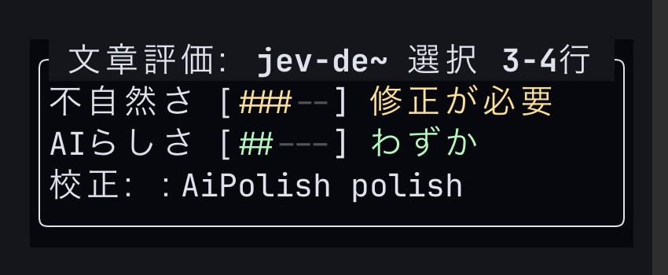
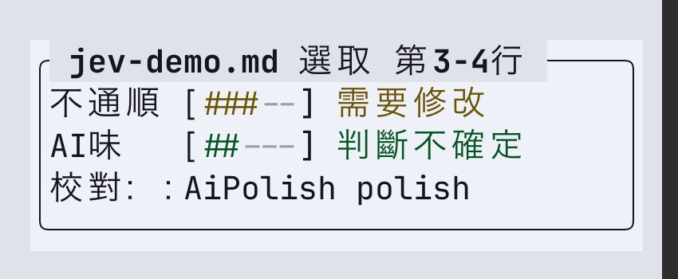
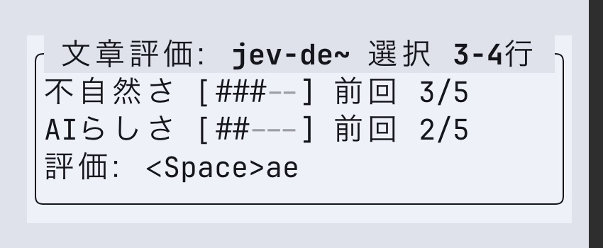
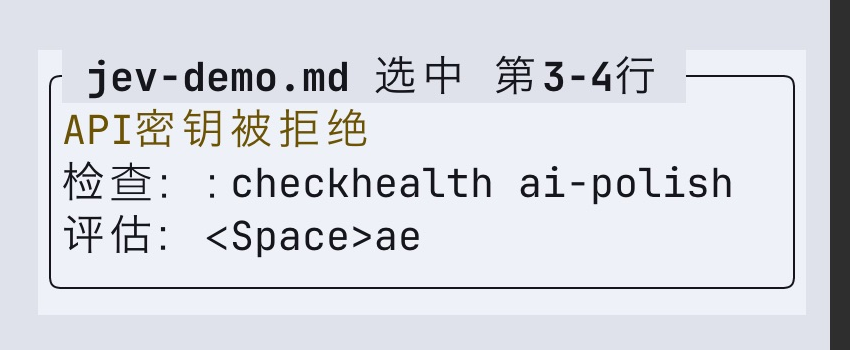
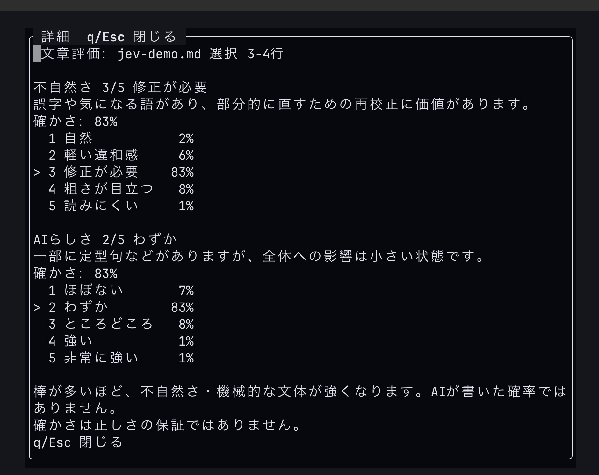

# Jev evaluation: design and validation

Implementation for [Issue #7](https://github.com/umiyosh/ai-polish.nvim/issues/7).

## Why a separate entry

Evaluation is useful before Gemini proofreading, to decide whether proofreading is worth doing. One explicit evaluation action sends the current target to Jev; a separate toggle displays cached results for free. The passive corner panel preserves editing focus. Its footer shows evaluation, hide and details with the actual mappings for the current mode, falling back to complete commands when unmapped. Existing correction-popup actions are unchanged, so evaluation does not introduce another acceptance mode.

With a configured key, successful Gemini proofreading automatically evaluates its current target and opens the panel, even when no corrections were found. Each successful acceptance evaluates the updated proofreading target; accept-all evaluates once. When an evaluated panel is visible, `InsertLeave` reevaluates the retained target only if its text differs from the last request. Unchanged text, hidden panels and edits outside the selected target do not send requests. Normal-mode edits (including `x`, `d`, paste, undo and redo) also trigger a check after a 400 ms debounce, provided the same source remains active in Normal mode. The same automatic limits apply. Automatic checks are limited to 3,000 characters and two requests, additionally respecting existing lower guards. Large targets require explicit evaluation. Set `evaluation.auto_max_chars=0` to opt out. Automatic events do not invoke key callbacks, confirm large requests, retry failures, or reopen a manually hidden panel on acceptance. Superseded requests are cancelled and late responses ignored.

A selected target stays anchored through edits. The same evaluation key follows it; `evaluate buffer` explicitly switches to the whole document. Deleting a target invalidates it instead of silently widening scope. `polish` uses the current retained target, while existing proofreading commands retain their old scopes. Active Visual hints are shown only for a matching selection (exclusive selections use the safe command fallback).

The default panel is 30 content cells and two axes on separate rows. Optional `panel_width=60` permits a single row only when all localized states fit. ASCII bars avoid East Asian Ambiguous-width symbols. Stage colors are semantic, theme-overridable, and independent of deletion red. Stale text remains readable; AI-style confidence below 0.5 replaces the stage label with a generic uncertainty cue. This threshold is a presentation choice, not calibrated accuracy.

Claude Code reviewed the entrance design in two rounds, the implementation copy/layout, and real Neovim screenshots. The implementation incorporates compact default width, explicit line units, truncated-name markers, aligned probabilities, current-stage descriptions, conditional stale notices, and a persistent close hint in the details title.

## Actual UI captures

These are crops of real Neovim terminal screenshots with **offline fixture results**. They demonstrate UI behavior, not model quality. The offline demo explicitly labels results as fixtures and intercepts all HTTP.

Japanese, retained selection, dark theme:



Traditional Chinese, local unnaturalness and low-confidence AI style, light theme:



Japanese, previous result after editing:



Simplified Chinese, rejected configured key (different from no-key suppression):



Cached Japanese local-evidence details, updated October 2 (q/Esc closes, j/k scrolls):



Reproduce without a key or network from the repository root:

```sh
nvim -u scripts/jev-demo.lua
```

The demo uses the worktree's runtime path, not an installed plugin copy. `:lua print(vim.api.nvim_get_runtime_file("lua/ai-polish/evaluation.lua", false)[1])` shows the loaded source. Personal dotfiles and installed plugin pins are not changed.

## Model contract

[TypeSafe's API](https://docs.typesafe.ai/api) accepts typed questions. Rubric v2 ports the final merged [Kotobae #41](https://github.com/umiyosh/kotobae/pull/41) and [#44](https://github.com/umiyosh/kotobae/pull/44), pinned at `9249f86e0edd5b89f755389b749980c82d3b0aac`. The latter replaced whole-text-only unnaturalness scoring after local errors were missed and correct text overflagged. Earlier prompt-only changes are superseded.

- **Local unnaturalness:** each sentence and its short spans get a [Noul](https://docs.typesafe.ai/primitives/noul) asking whether the excerpt is correct in context. Error evidence is `1 - noul`; it is not Noul confidence (Noul has no separate confidence). Average each sentence's evidence with its worst span, then take the document maximum. Values >=0.25 yield level 2; >=0.37 yield 3. Whole-text Score contributes levels 4/5 only if local evidence >=0.25. No Gemini findings enter this judgment.
- **Japanese parity:** the exact Japanese Score/Noul copy, thresholds, sentence splitting, adjacent two-chunk spans, parenthesis handling and closed-list subject-predicate mismatch rule are ported. The 165-case upstream golden corpus verifies segmentation and the rule. PR #41's neutral repeated-kana reference is capped at 32 entries × 80 characters. The original state text is preserved. Correct repetition is not automatically an error.
- **Chinese/English adaptation:** local questions respect source language, Simplified/Traditional variants, proper names, terms and optional style. Use punctuation-delimited clauses; do not cut Chinese words into fixed character windows or apply Japanese particles/structure rules. Thresholds are reused provisionally, **not calibrated for these languages**. Auto detection chooses Japanese when kana occurs, Chinese for Han-only text, otherwise English; explicit `evaluation.language` overrides it. Mixed/kanji-only Japanese can require that override. No script conversion. English periods remain inside a segment (avoiding abbreviation/decimal splits); coverage is labeled text segments rather than sentence counts.
- **Batching/cost:** at most 60 questions per request, four requests active and 16 total. Short text retains full context in one request. Longer text uses a whole-text Score batch and sentence-group context for local batches. Each sentence retains at most 59 spans. Unchecked sentences/omitted spans are counted, and the panel says partial instead of implying complete coverage. Above existing confirmation guards, the planned request count and coverage are shown. No automatic retries. A failed/malformed batch fails the whole run; cancellation stops active and queued work and drops late responses.
- **Evidence UI:** unnaturalness details show coverage and up to three findings, distinguishing rule-based findings. They do not display unrelated whole-Score confidence or probabilities as if those described the local level. AI style remains a five-level Score with argmax + 1, lower tie, separate confidence, and an uncertainty cue. Partial and provisional are different notices.

The endpoint is fixed; private header-file transport and cleanup remain. Only target text and a language hint are sent, never Gemini suggestions, filenames or neighboring text. Unknown/malformed is not level 1. AI style is not an authorship classifier. The exact Japanese contract is in `lua/ai-polish/jev_ja.json`; translated/local adaptation and aggregation are in `jev_local.lua`.

## Validation boundary (2026-10-02)

- Local `make check`: 91 tests, including 165 upstream golden cases, threshold boundaries, kana reference bounds, Chinese segmentation/script preservation, partial coverage, parallel batches, cancellation, malformed responses and evidence UI. No API keys required.
- Kotobae's reported Japanese live accuracy is upstream evidence, **not a measured accuracy claim for this Lua implementation or Chinese**. Current environment has no `TYPESAFE_API_KEY`; real API evaluation is not run.

### Prior UI validation (2026-10-01)

- Local `make check`: lint, format, and all existing/new mocked tests pass. Tests cover Unicode/reversed/exclusive/linewise Visual targets, invalidated ranges, optional keys, bounded proofreading/acceptance requests and otherwise manual-only evaluation, hide-during-request, late-response cancellation, per-tab visibility, special buffers, details, mapping shadows, CJK display width, and the evaluate → Gemini → accept → reevaluate round trip.
- Neovim actual UI: Japanese panel/details in dark mode; Traditional Chinese uncertainty and Japanese stale state in light mode; Simplified Chinese authentication error. Screenshot review by Claude Code. Mocked results are clearly identified.
- Real Jev multilingual quality comparison **not run**: this execution environment has no `TYPESAFE_API_KEY`. The live runner exits locally before any request. No Kotobae credential was copied. Native Chinese wording review and the user's normal Neovim acceptance remain unverified.
- CI minimum Neovim 0.11 / stable results are recorded on the PR, separately from local results.

Thirty-nine synthetic examples are in `tests/fixtures/jev-cases.json`: nine development cases plus two held-out normal/error pairs per language. The additional cases cover optional style, repeated kana, Japanese structure, Chinese local errors and legitimate repetition. They include correct prose, typos, grammar, technical terms, notes, and formulaic prose. These are comparison prompts, not guaranteed expected model classifications or native-speaker-validated Chinese benchmarks.

Once the key is configured locally, run explicitly (39 evaluations; one or more paid requests each):

```sh
nvim -l scripts/jev-live.lua /tmp/jev-results.json
```

The output path must be new. The report stores case IDs, requested model alias, rubric version, planned request counts, local levels/coverage, AI-style distributions/confidence, latency and safe error codes; it excludes findings text, keys and provider error text. Inspect normal/error pairs and record false positives/negatives separately for each language. Do not lower a threshold merely to fit reported examples, and do not claim the Japanese baseline is calibrated for Chinese. Rerunning is another explicit paid comparison. A wrong judgment can have high confidence.

## October 2 UI review

Claude Code (fable5/high, via a dedicated tmux review; no permission denials) reviewed the local-evidence UI. Findings now precede coverage/method notes; threshold numbers stay in implementation documentation; confirmation names target length and repeated excerpts separately from request count. English coverage says segments rather than sentences. Partial markers also cover omitted spans so a whole sentence cannot imply all its local spans were checked. Codex verified the updated Japanese details and Traditional Chinese panel in real Neovim with fixture responses; this is rendering evidence, not live model quality.
